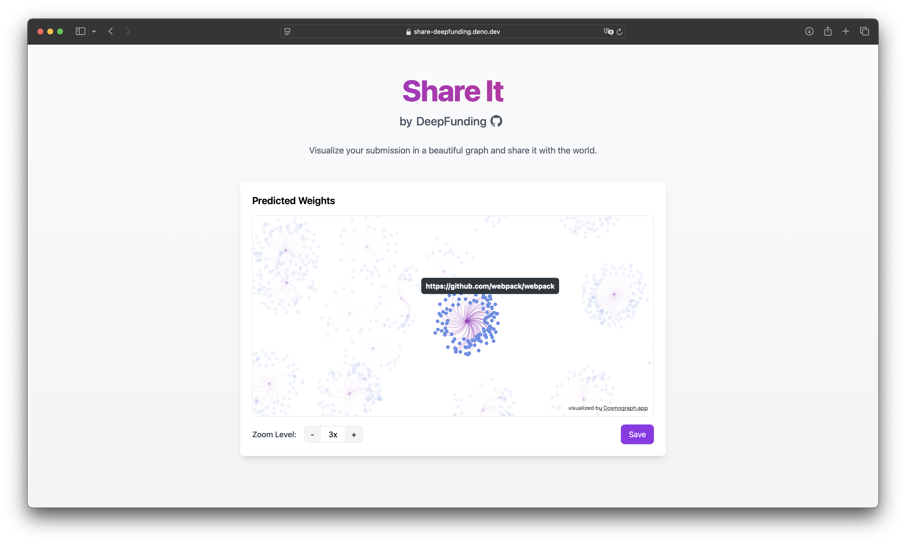

# Share It

Visualize your predicted funding weights submitted for the DeepFunding
mini-contest through a beautiful and interactive graph. Share your allocation
with the world and see how you stack up against other participants.

## Development

> [!NOTE]
> You will need to have [Deno](https://deno.land) installed.

1. Clone the repository

```bash
git clone https://github.com/deepfunding/share-it.git
```

2. Run the development server

```bash
cd share-it
deno task dev
```

3. Open your browser and navigate to [`localhost:8000`](http://localhost:8000)


